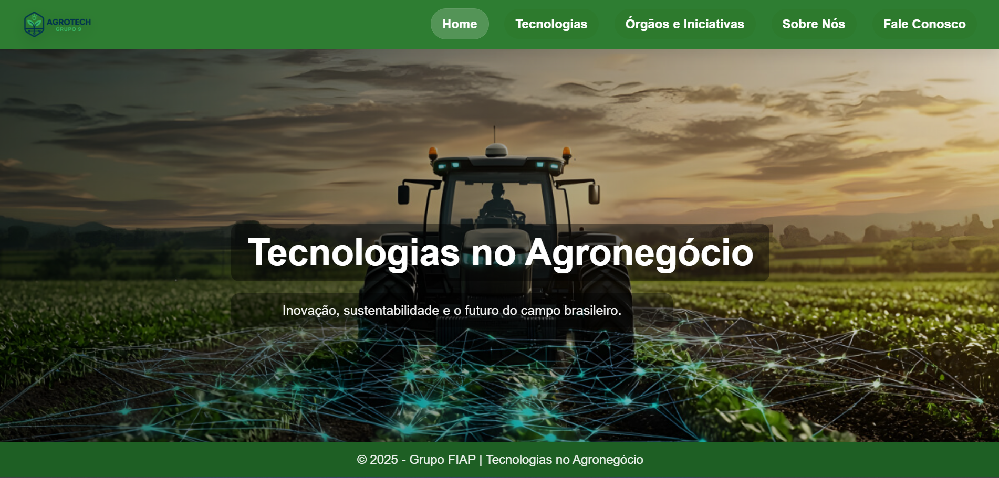

_Última atualização: **Fase 5** (Aplicar o conceito de React em toda a construção)_.

# Agrotech 

O AgroTech é um projeto desenvolvido pelo [Grupo 09](https://github.com/FIAP09) da [FIAP](https://www.fiap.com.br/) com o objetivo de demonstrar como as tecnologias emergentes estão transformando o agronegócio brasileiro.

Nosso propósito é evidenciar como inovação, sustentabilidade e tecnologia podem aumentar a produtividade no campo, reduzir desperdícios e contribuir diretamente para o combate à fome e para a segurança alimentar no Brasil.

O agronegócio é um dos pilares da economia brasileira, e acreditamos que o uso estratégico de ferramentas como Inteligência Artificial, IoT e automação é essencial para garantir um futuro mais eficiente, sustentável e inclusivo.

# Seções

## Home

A página inicial apresenta uma visão geral sobre o impacto da tecnologia no agronegócio brasileiro.
Destaca a modernização do campo por meio do uso de drones, sensores, Internet das Coisas (IoT) e Inteligência Artificial.

Também reforça a importância do agronegócio como um dos pilares da economia brasileira, responsável por exportações, geração de empregos e fortalecimento de cadeias produtivas como soja, milho e café.

## Tecnologias

Esta seção detalha as principais tecnologias aplicadas ao agronegócio.

## Órgãos e Iniciativas

Apresenta instituições, programas e iniciativas que atuam no desenvolvimento e na regulamentação do agronegócio e da tecnologia no Brasil.

O objetivo é mostrar como governo, instituições de pesquisa e empresas privadas colaboram para fortalecer o setor agrícola nacional.

## Sobre Nós

Seção institucional que apresenta o [Grupo 09](https://github.com/FIAP09) da [FIAP](https://www.fiap.com.br/), responsável pelo desenvolvimento do projeto.

Explica a missão, visão e propósito do grupo, além de apresentar seus integrantes e suas áreas de atuação.

## Fale Conosco

Espaço destinado ao contato com os desenvolvedores do projeto.

Permite que visitantes enviem dúvidas, sugestões ou feedbacks relacionados ao conteúdo apresentado no site.

# Tecnologia utilizada

O projeto foi desenvolvido utilizando **React**, uma biblioteca JavaScript moderna para construção de interfaces de usuário (UI).

O React permite a criação de aplicações web dinâmicas, rápidas e organizadas por meio do conceito de componentes reutilizáveis, facilitando a manutenção e escalabilidade do sistema.

## Vídeo pitch

O vídeo pitch pode da plataforma pode ser acessado usando o seguinte link: 

# Grupo

| Nome                       | RM |
| ---------------------------| -- |
| Felipe Staropoli de Paiva  | 567279 |
| Ramon da Silva Martins     | 566929 |
| Audibert Audibert          | 568080 |
| Thiago Augusto Saccomani   | 566731 |
| Lucas Sanches Coelho       | 566705 |
